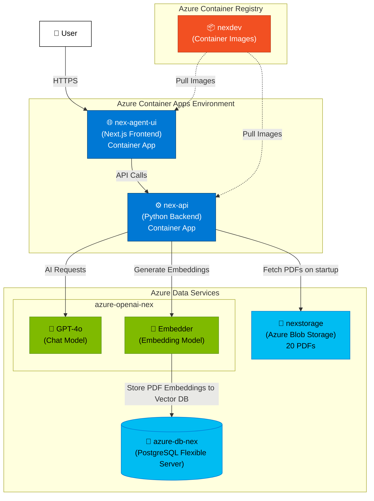

# Health Research Agent API

A FastAPI-based application for the **NEX (Network Explorer) Chatbot** and the **Social Econ Psych research group studies** at Uni Wien.

## Architecture




## Setup

### 1. Generate Requirements

Generate `requirements.txt` from `pyproject.toml`:

```sh
./scripts/generate_requirements.sh
```

To upgrade all dependencies to their latest compatible versions:

```sh
./scripts/generate_requirements.sh upgrade
```

```sh
./scripts/generate_requirements.sh linux-upgrade
```

For Linux deployment:

```sh
./scripts/generate_requirements.sh linux
```

### 2. Switch Environment

Switch between local and Azure environments:

```sh
./scripts/switch_env.sh local   # For local development
./scripts/switch_env.sh azure   # For Azure deployment
```

### 3. Development Setup

Create virtual environment and install dependencies (run after generating requirements):

```sh
./scripts/dev_setup.sh
```

Then activate the virtual environment:

```sh
source .venv/bin/activate
```

## Running the Application

### Local Development

Start the application with Docker:

```sh
docker compose up -d
```

In case of any requirements or Dockerfile changes:

```sh
docker compose up -d --build
```

View logs:

```sh
docker logs -f health-research-agent-api-api-1
```

### Azure Deployment

View Azure Container App logs:

```sh
az containerapp logs show --name health-research-api --resource-group health_research_network --type console --follow
```

View logs for a specific revision:

```sh
az containerapp logs show --name marhinovirus-study-api --resource-group socialeconpsyresearch --type console --revision marhinovirus-study-api--v1-1i --tail 300
```

## Deployment to Azure

To deploy to ACR:

1. Linux Upgrade

```sh
./scripts/generate_requirements.sh linux-upgrade
```

2. Enable the `build-and-push.yml` workflow action for automatic Azure deployment
3. Commit and deploy (will trigger Github Actions)

Useful commands for Azure Container Apps CI/CD:

0. Check the new revision's detailed status
   az containerapp revision list \
   --name marhinovirus-study-api \
   --resource-group socialeconpsyresearch \
   --query "[0].{revisionName:name,provisioningState:properties.provisioningState,healthState:properties.healthState,runningState:properties.runningState,replicas:properties.replicas,lastActiveTime:properties.lastActiveTime}" \
   --output table

1. deploy with env variable
   az containerapp update \
   --name marhinovirus-study-api \
   --resource-group socialeconpsyresearch \
   --image socialeconpsy-drdfgfb2g7aadtgk.azurecr.io/health-research-api:latest \
   --set-env-vars PROJECT_NAME=vax-study \
   --revision-suffix "$(date +%d | tr -d '\n')$(date +%b | tr '[:upper:]' '[:lower:]')"

2. verify the revisions are healthy
   az containerapp revision list \
    --name marhinovirus-study-api \
    --resource-group socialeconpsyresearch \
    --output table

3. remove the label on the older versions
   az containerapp revision label remove \
    --name marhinovirus-study-api \
    --resource-group socialeconpsyresearch \
    --label v1-1

4. add it to the new version
   az containerapp revision label add \
    --name marhinovirus-study-api \
    --resource-group socialeconpsyresearch \
    --revision marhinovirus-study-api--v1-1g \
    --label v1-1

5. verify new labels
   az containerapp ingress traffic show \
    --name marhinovirus-study-api \
    --resource-group socialeconpsyresearch

6. deactivate older revisions
   az containerapp revision deactivate --name marhinovirus-study-api --resource-group socialeconpsyresearch --revision marhinovirus-study-api--v1-a

## Testing

### Setup

Install dev dependencies (includes pytest):

```sh
pip install -e ".[dev]"
```

### Running Tests

Run tests:

```sh
pytest tests/ -v
```

### Test Coverage

Run tests with coverage report:

```sh
pytest tests/ -v --cov=services --cov=api --cov-report=term-missing
```

## Daily Budget System

The nex agent (`nex_agent`) has a daily budget enforcement system to control Azure OpenAI costs.

### Configuration

The following environment variables are required for `PROJECT_NAME=nex` and can be set in `.env.local` (local) and in Azure as an environment variable for the Container App:

| Variable                   | Example | Description                                   |
| -------------------------- | ------- | --------------------------------------------- |
| `DAILY_BUDGET_EUR`         | `2.0`   | Daily budget limit in EUR                     |
| `MODEL_PRICING_INPUT_EUR`  | `1.87`  | Cost per 1M input tokens                      |
| `MODEL_PRICING_OUTPUT_EUR` | `7.48`  | Cost per 1M output tokens                     |

Note: Pricing values above are examples only; actual values must match the selected model/provider pricing.

### How It Works

1. **Pre-check**: Before each `nex_agent` request, the system checks if the daily budget is exceeded
2. **Record usage**: After successful responses, token usage is recorded to the database
3. **Reset**: Budget resets at midnight Vienna time (Europe/Vienna timezone)

### API Behavior

**Successful response** (budget available):

- Returns chat content as normal
- Includes `X-Budget-Remaining-EUR` header with remaining budget

**Budget exceeded** (HTTP 429):

```json
{
  "error": "daily_budget_exceeded",
  "reset_time_utc": "2026-01-30T23:00:00+00:00",
  "remaining_eur": 0.0
}
```

### Database Setup

Create the usage tracking table:

```sql
CREATE TABLE daily_nex_agent_usage (
    id SERIAL PRIMARY KEY,
    date DATE NOT NULL,
    input_tokens INTEGER NOT NULL DEFAULT 0,
    output_tokens INTEGER NOT NULL DEFAULT 0,
    cost_eur FLOAT NOT NULL DEFAULT 0.0,
    created_at TIMESTAMP NOT NULL DEFAULT NOW()
);

CREATE INDEX ix_daily_nex_usage_date ON daily_nex_agent_usage(date);
```

### Query Daily Usage

Use the provided SQL script to check usage for a specific date:

```sh
psql -v target_date="'29-Jan-2026'" -v daily_budget=2.0 -f scripts/sql/get_daily_nex_usage.sql
```
