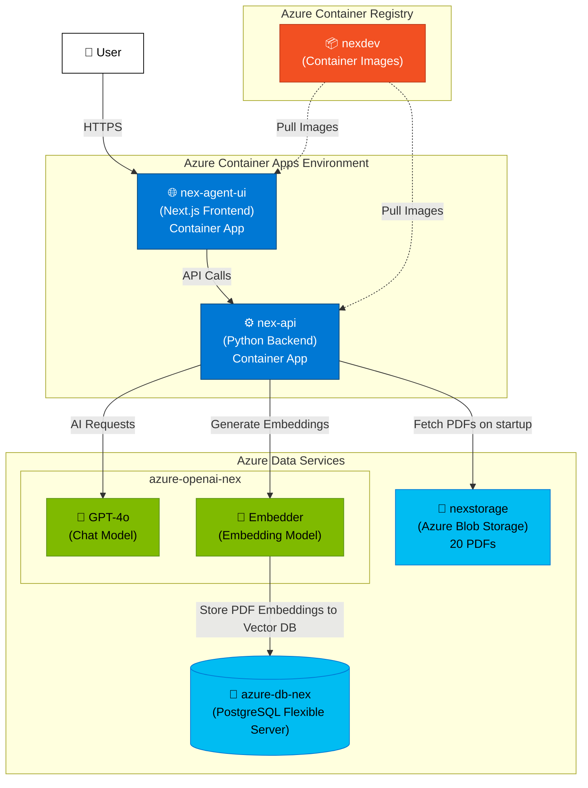

# Health Research Agent API

A FastAPI-based application for the **NEX (Network Explorer) Chatbot**, the **SSC Psychologie Assistant** (yet-to-be-developed), and the **Social Econ Psych research group studies** at Uni Wien.

This platform powers three AI-assisted tools at the University of Vienna. **NEX** is a conversational agent for the Health in Society network that enables researchers to explore a curated knowledge base of literature on health and its intersections with society through natural language queries, backed by semantic search over PDF-embedded vector stores and GPT-4o. **SSC Psychologie** is a bilingual chatbot for the Student Service Center for Psychology, helping prospective students and the public find information about psychology study programs by drawing on scraped SSC website content and downloadable documents. **Vax Study** is a controlled-language chatbot designed for vaccine communication research, delivering factually accurate, regulation-compliant responses about vaccination side effects and outcomes. All tools share a FastAPI backend with project-specific RAG pipelines, pgvector storage, and Azure OpenAI, deployed as separate Azure Container Apps per project.

## Architecture



## Setup

### 1. Generate Requirements

Generate `requirements.txt` from `pyproject.toml`:

```sh
./scripts/generate_requirements.sh
```

To upgrade all dependencies to their latest compatible versions:

```sh
./scripts/generate_requirements.sh upgrade
```

```sh
./scripts/generate_requirements.sh linux-upgrade
```

For Linux deployment:

```sh
./scripts/generate_requirements.sh linux
```

### 2. Switch Environment

Switch between local and Azure environments:

```sh
./scripts/switch_env.sh local   # For local development
./scripts/switch_env.sh azure   # For Azure deployment
```

### 3. Development Setup

Create virtual environment and install dependencies (run after generating requirements):

```sh
./scripts/dev_setup.sh
```

Then activate the virtual environment:

```sh
source .venv/bin/activate
```

## Running the Application

### Local Development

Start the application with Docker:

```sh
docker compose up -d
```

In case of any requirements or Dockerfile changes:

```sh
docker compose up -d --build
```

View logs:

```sh
docker logs -f health-research-agent-api-api-1
```

### Azure Deployment

See [`azure_infra_config/deploy-test.md`](azure_infra_config/deploy-test.md) for full deployment commands.

View NEX Container App logs:

```sh
az containerapp logs show --name nex-agent-api --resource-group healthsociety --type console --follow --tail 300
```
